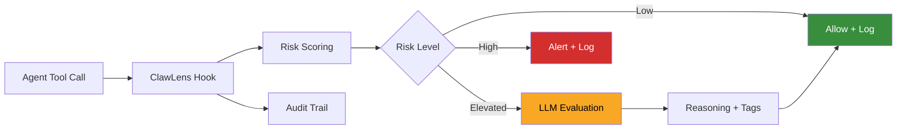

> **TODOs before launch:**
> - [ ] Wordsmith — review tone, phrasing, and flow with Neelabh
> - [ ] Screenshot — take real dashboard screenshot, save to `docs/screenshots/homepage.png`
> - [ ] GitHub org — decide AvidClaw vs nk3750 vs new `clawlens` org, update clone URL
> - [ ] Test install flow — run the Quick Start steps on a clean machine end-to-end
> - [ ] Add logo — once designed, add at top of README
> - [ ] Remove this TODO block before launch

<!-- TODO: Add logo here once designed -->

# ClawLens

**Your agents are doing things right now. Do you know what?**

ClawLens is an open-source [OpenClaw](https://openclaw.ai/) plugin that watches every tool call your AI agents make, scores each one for risk, and tells you when something needs your attention — before it's too late.

<!-- TODO: Replace with actual screenshot of dashboard showing agents, risk scores, and activity feed -->


## Why This Exists

An AI researcher told her agent to "confirm before acting." It deleted 200 emails — the instruction vanished during context window compaction. A developer set up a morning digest agent. It sent 500+ iMessages to his contacts. He pulled the power cord to stop it.

In every case, the agent had permission. What was missing: a layer *outside the agent's memory* that watches what it does and asks — **does the user actually want this?**

That's ClawLens.

## What You See

- **Every agent, one dashboard** — status, current session, activity breakdown, risk posture
- **Every action, scored for risk** — a two-tier engine evaluates tool calls instantly as they happen
- **Intelligent evaluation** — high-risk calls get LLM analysis that explains *why* something is dangerous, with risk tags like `exfiltration`, `destructive`, `persistence`
- **Alerts in real-time** — dangerous actions trigger Telegram notifications within seconds
- **Live activity feed** — tool calls stream in as they happen, color-coded by risk
- **Guardrails you create** — block or require approval for specific actions, built from behavior you've observed
- **Tamper-evident audit trail** — every action logged, hash-chained, exportable, verifiable
- **Zero configuration** — install, open the dashboard, your agents appear. No YAML. No setup wizard.

## Get Started

```bash
openclaw plugins install clawlens
```

Restart the gateway. Open the dashboard:

```
http://localhost:18789/plugins/clawlens/
```

Your agents show up the moment they make their first tool call. That's the entire setup.

<details>
<summary><strong>Install from source</strong></summary>

```bash
# TODO: Confirm GitHub org before launch
git clone https://github.com/AvidClaw/clawLens.git
cd clawLens
npm install
cd dashboard && npm install && npm run build && cd ..
npx tsc -p tsconfig.json
```

Add to your OpenClaw config (`~/.openclaw/openclaw.json`):

```json
{
  "plugins": {
    "load": { "paths": ["/path/to/clawLens"] },
    "entries": { "clawlens": { "enabled": true } }
  }
}
```

Restart the gateway.

</details>

## How It Works

ClawLens sits inside OpenClaw's plugin hook system. Every tool call passes through it *before* execution — not after.



**Tier 1** scores every call deterministically — tool type, parameters, command patterns. Instant, every call.

**Tier 2** kicks in for elevated-risk actions — an LLM evaluates the command in context, returns structured reasoning and risk tags. Most routine calls (reads, searches, file lookups) never reach Tier 2.

ClawLens **complements** OpenClaw's built-in security. It doesn't replace exec approvals or tool profiles — it adds the layer that asks *"is this what the user intended?"* on top.

## What ClawLens Catches

| Scenario | What happens |
|----------|-------------|
| Agent reads `.env` then calls an external URL | Risk spikes. LLM flags the sequence as a potential exfiltration pattern. Alert fires. |
| Agent runs `rm -rf` or force-pushes to main | Guardrail blocks it before execution. Logged with full context. |
| Agent sends messages to your contacts | Flagged as high-risk communication. You decide whether it goes through. |
| Agent installs packages or modifies cron jobs | Elevated risk — persistence and supply chain actions are scored and tracked. |
| Agent does 200 routine reads | Low risk, scored instantly, no friction. You see them in the feed but nothing demands attention. |

## Built With

TypeScript (strict mode) · React · Tailwind CSS · Vite · [OpenClaw Plugin SDK](https://openclaw.ai/)

## Contributing

PRs and issues welcome. See [CONTRIBUTING.md](CONTRIBUTING.md) for setup and guidelines.

## License

[MIT](LICENSE)
