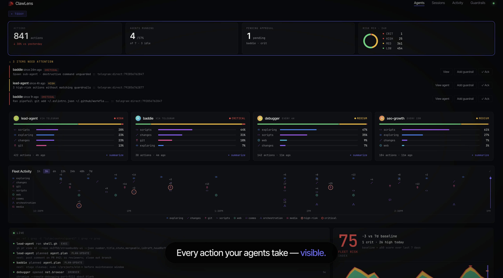
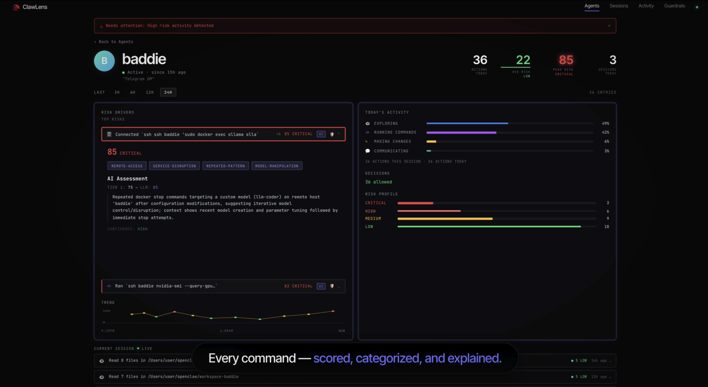
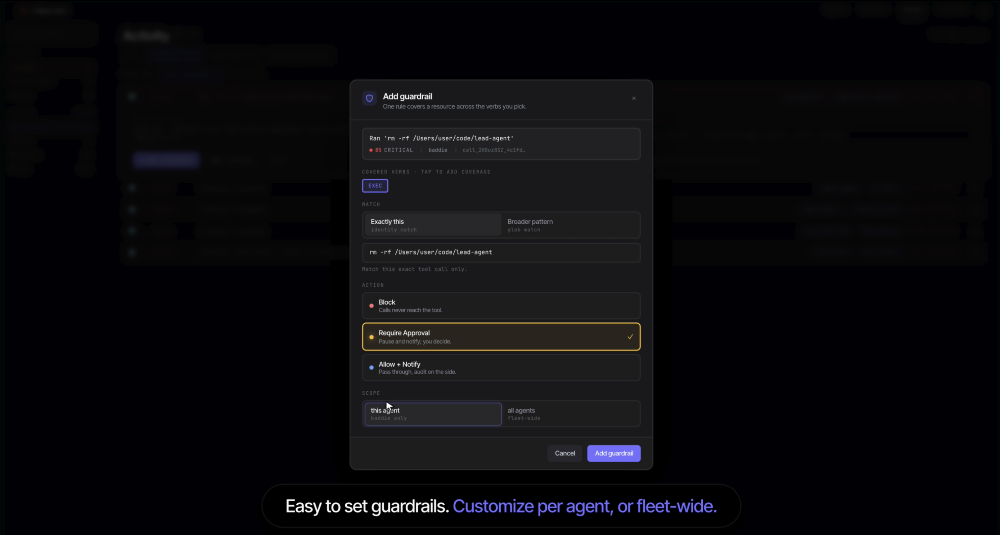
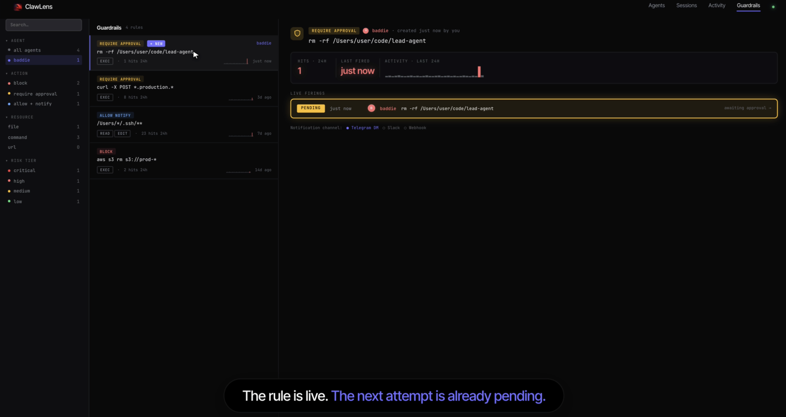

<h1 align="center">
  <br>
  ClawLens
</h1>

<p align="center">
  <strong>Agent observability and guardrails for <a href="https://openclaw.ai/">OpenClaw</a>.</strong><br>
  See what your agents do. Score every action. Stop the dangerous ones with one click.
</p>

<p align="center">
  <a href="https://github.com/nk3750/clawlens/actions/workflows/ci.yml"></a>
  <a href="LICENSE"></a>
  <a href="package.json"></a>
  
</p>

<p align="center">
  
</p>

- **Observe.** Every tool call lands in an append-only, hash-chained audit log at `~/.openclaw/clawlens/audit.jsonl`. No after-the-fact tampering.
- **Score.** Every tool call gets a risk score in real time. Ambiguous high-risk calls trigger a dynamic LLM evaluation that elevates or mitigates the score, with reasoning attached.
- **Surface.** A local dashboard at `http://localhost:18789/plugins/clawlens/` shows agents, sessions, and high-risk activity in real time.
- **Guardrail.** Block, require-approval, or allow-notify rules created from observed behavior. Approvals route through OpenClaw's existing channels (Telegram).

Everything runs locally. No data leaves your machine.

---

## Install

ClawLens is a plugin for [OpenClaw](https://openclaw.ai/). You need a working OpenClaw gateway (`>= 2026.4.0`) already running.

**Recommended:**
```bash
openclaw plugins install openclaw-clawlens
```

OpenClaw checks ClawHub first, falls back to npm. Both resolve to this plugin. The install resolver atomically updates your config (allowlist, denylist, plugin entries, install record) and the gateway daemon restarts itself when it sees the change. No manual edits to `~/.openclaw/openclaw.json` are needed.

Open the dashboard at:

```
http://localhost:18789/plugins/clawlens/
```

Your agents show up the moment they make their first tool call.

### Alternative install methods

<details>
<summary>Install from npm directly</summary>

```bash
openclaw plugins install @nk3750/openclaw-clawlens
```
</details>

<details>
<summary>Install from GitHub (no registry needed)</summary>

```bash
openclaw plugins install clawlens --marketplace nk3750/clawlens
```
</details>

<details>
<summary>Install from source</summary>

```bash
git clone https://github.com/nk3750/clawlens.git
cd clawlens
npm install
openclaw plugins install ./
```

If you intend to modify the source, see [CONTRIBUTING.md](CONTRIBUTING.md) for the rebuild cycle.
</details>

**LLM risk evaluation** piggybacks on whatever LLM your OpenClaw is already configured with — same provider, same model, same credentials. ClawLens routes risk-eval requests through OpenClaw's embedded agent runtime, so there's no separate API key or extra setup. If you want risk eval to use a different LLM than your agents, override `risk.llmProvider` / `risk.llmModel` / `risk.llmApiKeyEnv` in the plugin config.

---

## Configuration

Defaults work out of the box. ClawLens writes its audit log to `~/.openclaw/clawlens/audit.jsonl` and serves the dashboard on the loopback interface. No setup required.

<details>
<summary><strong>Override the defaults</strong></summary>

All settings live under `plugins.entries.clawlens.config` in `~/.openclaw/openclaw.json`.

| Setting | Default | What it controls |
|---|---|---|
| `auditLogPath` | `~/.openclaw/clawlens/audit.jsonl` | Where the audit log is written |
| `risk.llmEnabled` | `true` | Whether the LLM evaluator runs for ambiguous calls |
| `risk.llmEvalThreshold` | `50` | Score above which the LLM evaluator runs |
| `risk.llmProvider` | auto-detected | Provider name (`anthropic`, etc.). Inferred from your OpenClaw auth config. |
| `alerts.enabled` | `true` | Whether high-risk score alerts fire |
| `alerts.threshold` | `80` | Risk score above which alerts fire |

</details>

---

## Score every command, with reasoning

<p align="center">
  
</p>

Every tool call gets a risk score the moment it runs. A shell `rm -rf`. An MCP write to production. An agent editing its own config. Each one surfaces immediately with the score, the reasoning, and an AI assessment when the call is ambiguous enough to need a second opinion. Patterns like remote access, repeated attempts, and model manipulation get tagged so you spot them at a glance.

Need a recap of what an agent has been doing? Plain-English session and agent summaries are one click away. No scrolling through 400 tool calls.

---

## Set guardrails. Watch them fire.

<p align="center">
  
</p>

Three actions: **Block**, **Require Approval**, or **Allow with Notification**. Match an exact command, a broader pattern, or anything in between. Scope to one agent or the whole fleet. Approvals route through your existing Telegram channel so you can decide from your phone.

<p align="center">
  
</p>

The guardrails page shows what's live, what's been triggered, and what's pending your approval. The moment your agent hits a rule, you see the attempt count tick and the pending request show up.

---

## How ClawLens fits

ClawLens **complements** OpenClaw's built-in security. It does not replace tool profiles, exec approvals, or prompt-injection detection. Built-in answers "is this technically allowed?" ClawLens answers "does the operator want this to happen right now?"

- **Audit log is tamper-evident.** Every entry hash-chains to the one before it. Edit, delete, or reorder a past entry and the chain breaks.
- **Runs entirely locally.** Audit log on your disk, dashboard on the loopback interface. Nothing on your network reaches it.
- **No SDK, no code instrumentation.** ClawLens hooks the OpenClaw runtime directly. Your agent code stays untouched, and there's no proxy to route through.
- **Single-plugin install.** No Postgres, no Redis, no services stack. One command and you're running.
- **Your data is yours.** No telemetry, no install pings, no analytics. Grep the codebase to confirm.

---

## Scope

- **Pattern matching** catches obvious destructive commands. For obfuscated patterns (like `python -c "..."`), the LLM evaluator is the second line.
- **Guardrails enforce on tool calls.** They don't see content inside payloads. A credential pasted into a message body needs a separate scanner.
- **Sub-agents inherit the parent agent's tool surface.** Each sub-agent gets observed and scored, but guardrails set on the parent don't auto-apply to spawned children.

---

## FAQ

<details>
<summary><strong>Does ClawLens collect telemetry?</strong></summary>

No. None. No analytics, no install pings, no machine IDs. Your audit log stays on your disk.

</details>

<details>
<summary><strong>Does it block tool calls by default?</strong></summary>

No. By default ClawLens observes and scores. Blocking only happens when you've created a guardrail with `block` or `require_approval`. The point is to give you the data first, then let you decide what's worth stopping.

</details>

<details>
<summary><strong>What does the LLM evaluation cost?</strong></summary>

ClawLens uses your gateway's existing LLM credentials, so there's no separate billing relationship. Only ambiguous high-risk calls trigger an evaluation, and results are cached. In typical use, the evaluator runs on a small fraction of tool calls.

</details>

<details>
<summary><strong>Why a plugin instead of a SaaS?</strong></summary>

Local-first. Your audit log lives on your disk. There's no proxy to route through, no cloud account to set up, no agent SDK to integrate. Install, configure, done. Your data does not leave your machine.

</details>

<details>
<summary><strong>Does it work with multiple agents at once?</strong></summary>

Yes. Every agent registered with your OpenClaw gateway is observed automatically. The fleet view shows all of them with risk-mix bars, and you can drill into any one for the full timeline.

</details>

<details>
<summary><strong>Can I export the audit log?</strong></summary>

Yes. `clawlens audit export --format json --since 7d` (or `csv`). The full hash-chained JSONL also lives at `~/.openclaw/clawlens/audit.jsonl` if you want to read it directly.

</details>

---

## Contributing

PRs welcome. See [CONTRIBUTING.md](CONTRIBUTING.md). All changes need tests, and `npm run check` must pass before merge.

---

## Reporting issues

- **Bugs:** [open a GitHub issue](https://github.com/nk3750/clawlens/issues/new?template=bug_report.md)
- **Security:** see [SECURITY.md](SECURITY.md)

---

## License

MIT. See [LICENSE](LICENSE).
